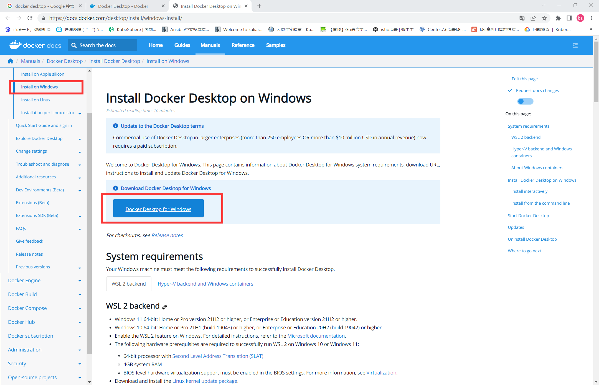
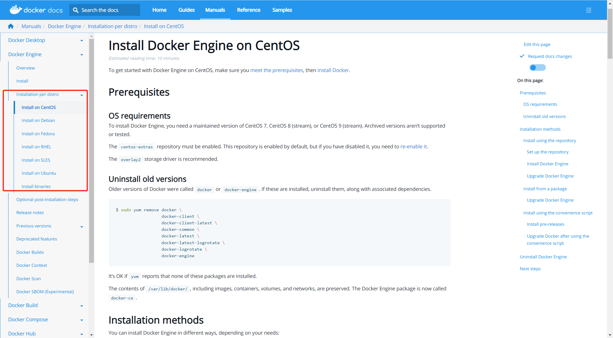
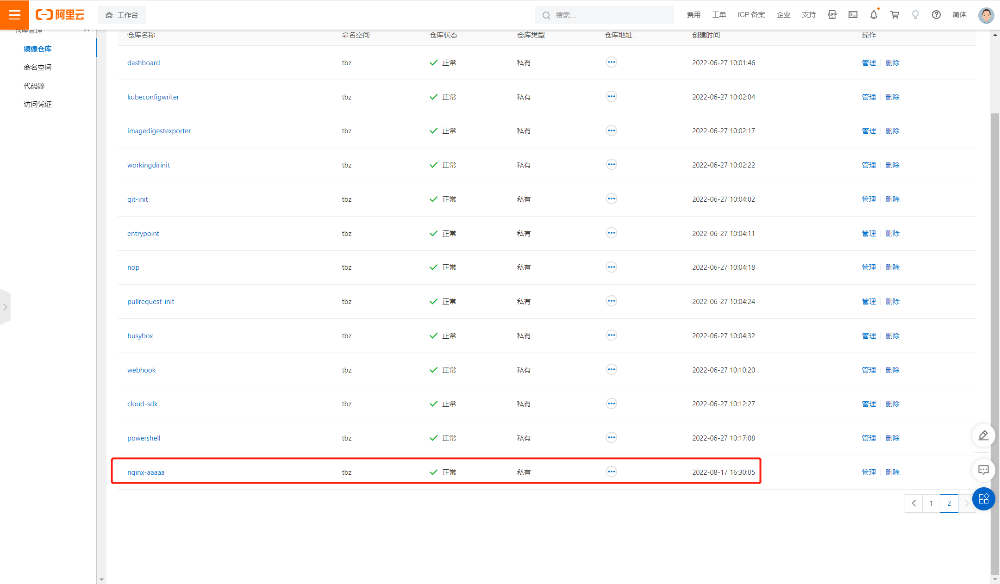

1. docker 安装  

windows：  
下载链接： https://docs.docker.com/desktop/install/windows-install/  
选择对应的系统版本，点击download

centos：   
下载链接： https://docs.docker.com/engine/install/centos/


安装命令
```shell
 yum install -y yum-utils
 yum-config-manager \
    --add-repo \
    https://download.docker.com/linux/centos/docker-ce.repo
 yum install docker-ce docker-ce-cli containerd.io docker-compose-plugin
 systemctl start docker && systemctl enable docker
```

2. docker配置 
通过填写registry-mirrors 为docker配置镜像加速器  
通过填写insecure-registries 为docker配置私有仓库地址  
```shell
[root@localhost opt]# vi /etc/docker/daemon.json 
{
  "registry-mirrors": ["https://e2hddcle.mirror.aliyuncs.com"],
  "insecure-registries": ["10.10.1.1:30002"],
  "exec-opts": ["native.cgroupdriver=systemd"]
}
[root@localhost opt]# systemctl daemon-reload
[root@localhost opt]# systemctl restart docker
```
3. docker常用命令  
* 基本操作

**images**
```
docker images 
查看docker中所有本地镜像
```
**login**
```
docker login  ${registryurl}  
登录共有或私有仓库，登录后便可拉取、推送镜像
```
* 镜像操作

**pull**
```
docker pull ${imagetag}
将远端仓库镜像拉取到本地
```
**tag**
```
docker tag  ${imagesid}  ${tag}
可以通过镜像id或者镜像tag 为镜像打上新tag 
```
**push**
```
docker push  ${imagetag}
将本地镜像推送到远端仓库
```
**build**
```
docker build -t ${imagetag} .
通过当前路径的dockerfile 打包镜像，并且tag为 ${imagetag}
```
**rmi**
```
docker rmi  ${imageid}
docker rmi  ${imagetag}
通过镜像id或tag删除镜像，当有被使用的镜像时无法删除
通过tag删除镜像时，有先后顺序，需要先删除镜像最新的tag，然后删除镜像
```
**load**
```
docker load -i ${image.tar}
将本地tar包导入为docker镜像
```
* 容器操作

**run**
```
docker run  ${imageid}
docker run  ${imagetag}
通过镜像id或镜像tag运行容器
```
**ps**
```
docker ps
查看所有处于运行中的容器
docker ps -a
查看所有容器，包括运行中、退出的容器
```
**exec**
```
docker exec -it  ${containerdid} bash
通过容器id进入容器内进行操作
```
**logs**
```
docker logs  ${containerdid}
docker logs  ${containerdname}
通过容器id或名称查看容器内的日志
```
**rm**
```
docker rm ${containerdid}
删除docker容器
```
4. 示例

```shell
#使用nginx镜像，前台启动一个名为mynginx的容器，将容器80端口映射到本地81端口，并且容器退出时删除
docker run --rm --name mynginx  -p81:80 nginx

#使用nginx镜像，后台启动一个名为mynginx的容器，将容器80端口映射到本地81端口
docker run -d --name mynginx  -p81:80 nginx

#使用docker build构建自己的应用
[root@localhost nginx]# ls
dist.zip  Dockerfile  nginx.conf
```

```Dockerfile
FROM nginx:alpine
ADD nginx.conf /etc/nginx/nginx.conf
ADD dist /usr/share/nginx/html/
```

```shell
    #user  nginx;
    worker_processes  1;

    #error_log  logs/error.log;
    #error_log  logs/error.log  notice;
    #error_log  logs/error.log  info;

    #pid        logs/nginx.pid;


    events {
        worker_connections  1024;
    }


    http {
        client_max_body_size 20M;
        include       mime.types;
        default_type  application/octet-stream;

        #log_format  main  '$remote_addr - $remote_user [$time_local] "$request" '
        #                  '$status $body_bytes_sent "$http_referer" '
        #                  '"$http_user_agent" "$http_x_forwarded_for"';

        #access_log  logs/access.log  main;

        sendfile        on;
        #tcp_nopush     on;

        #keepalive_timeout  0;
        keepalive_timeout  65;

        #gzip  on;

    server {
      listen       80;#端口
      root         /usr/share/nginx/80;#项目路径

      # Load configuration files for the default server block.
      include /etc/nginx/default.d/*.conf;

      # 解决web单页面开发模式 nginx代理后刷新显示404
      location / {
        index index.html;
        try_files $uri $uri/ /index.html;
      }
      
      location /prod-api {
        rewrite  ^/.+\-api/?(.*)$ /$1 break;
#        proxy_pass http://servicename/; #node api server 即需要代理的IP地址
        proxy_redirect off;
        proxy_set_header Host $host;
        proxy_set_header X-Real-IP $remote_addr;
        proxy_set_header X-Forwarded-For $proxy_add_x_forwarded_for;
      }
      
      error_page 404 /404.html;
      location = /40x.html {
      }
      error_page 500 502 503 504 /50x.html;
      location = /50x.html {
      }

      location ~ .*\.(gif|jpg|jpeg|png|bmp|swf|ico|pdf)$ {
        # rewrite    ^/.+\-api/profile/?(.*)$ /$1 break;
        # root       /uploadPath/;
        # autoindex  on;  
        expires    30d;
      }

      location /prod-api/profile {
        rewrite    ^/prod-api/profile/?(.*)$ /$1 break;
        root       /uploadPath/;
        autoindex  on;
        expires    30d;
      }

      location ~ .*\.(js|css)?$ {
        expires 15d;
      }
      access_log off;
    }

    }
```


```shell
#通过docker build打包镜像
[root@localhost nginx]# docker build -t nginx-test .
Sending build context to Docker daemon  22.38MB
Step 1/4 : FROM nginx:alpine
 ---> cc44224bfe20
Step 2/4 : EXPOSE 80
 ---> Using cache
 ---> c65ba92cd1fa
Step 3/4 : COPY nginx.conf /etc/nginx/nginx.conf
 ---> Using cache
 ---> 191f3829621b
Step 4/4 : COPY dist /usr/share/nginx/80
 ---> d8ce8f309695
Successfully built d8ce8f309695
Successfully tagged nginx-test:latest
[root@localhost nginx]# docker images
REPOSITORY   TAG       IMAGE ID       CREATED          SIZE
nginx-test   latest    d8ce8f309695   21 seconds ago   45.4MB
nginx        alpine    cc44224bfe20   7 months ago     23.5MB

# -d 为后台运行  -p  将宿主机81端口和容器80端口进行映射  --name  容器名称为nginx-dist  使用镜像为nginx-test:latest 
[root@localhost nginx]# docker run -d -p 81:80 --name nginx-dist nginx-test:latest
c209d97e75e4326610be0adc568e27d2ce9c6b42065b3e90602ea60e3c6c7433
```


```shell
#登录到公有仓库
[root@localhost nginx]# docker login --username=t819088691 registry.cn-hangzhou.aliyuncs.com
Password: 
WARNING! Your password will be stored unencrypted in /root/.docker/config.json.
Configure a credential helper to remove this warning. See
https://docs.docker.com/engine/reference/commandline/login/#credentials-store

Login Succeeded


[root@localhost nginx]# docker images
REPOSITORY   TAG       IMAGE ID       CREATED         SIZE
nginx-test   latest    d8ce8f309695   3 minutes ago   45.4MB
nginx        alpine    cc44224bfe20   7 months ago    23.5MB

#将本地构建的镜像打上新tag，符合公有仓库的格式
[root@localhost nginx]# docker tag nginx-test:latest registry.cn-hangzhou.aliyuncs.com/tbz/nginx-aaaaa:latest

#上传镜像
[root@localhost nginx]# docker push registry.cn-hangzhou.aliyuncs.com/tbz/nginx-aaaaa:latest
The push refers to repository [registry.cn-hangzhou.aliyuncs.com/tbz/nginx-aaaaa]
c0a2e9bb64b3: Pushed 
6c0065ae39df: Pushed 
419df8b60032: Pushed 
0e835d02c1b5: Pushed 
5ee3266a70bd: Pushed 
3f87f0a06073: Pushed 
1c9c1e42aafa: Pushed 
8d3ac3489996: Pushed 
latest: digest: sha256:5d58fa6235e6ca48e972371f31a057c545bcf7288d7d64fc80d1105f4263015c size: 1987
```

验证镜像是否存在
