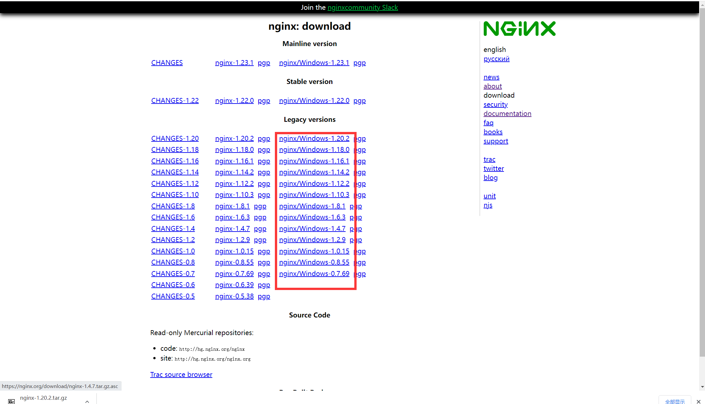

1. nginx安装
linux安装下载链接：https://nginx.org/en/linux_packages.html#RHEL-CentOS

windows安装下载链接： https://nginx.org/en/download.html



2. nginx常用配置
Nginx配置文件主要分成四部分：
* main（全局设置）
```shell
#user  nginx;

#nginx 进程数，通常更具虚拟机配置来设置，cpu*2
worker_processes  1;

#error_log  logs/error.log;
#error_log  logs/error.log  notice;
#error_log  logs/error.log  info;

#pid        logs/nginx.pid;

#单个工作进程可以允许同时建立外部连接的数量
events {
    worker_connections  1024;
}
http {
    xxx
    xxx
    xxx
    upstream  backend2  {}
    upstream  backend  {}
    server {
        listen       80;
        location  /xxx {}
        location  / {}
    }
    server {
        listen       81;
        location  /xxx {}
        location  / {}
    }    
}
```
* server（主机设置）
```shell
server {
    #nginx虚拟主机监听端口
    listen       80;
    server_name  localhost;
    root   /apps/oaapp;
    charset utf-8;
    access_log  logs/host.access.log  main;
    #对 / 所有做负载均衡+反向代理
    location / {
        root   /apps/oaapp;
        index  index.jsp index.html index.htm;
        #请求转向定义的服务器列表，即反向代理，对应upstream负载均衡器或直接转发至某台服务器
        proxy_pass        http://ip:port; 
        proxy_pass        http://backend;  
        proxy_redirect off;
        # 后端的Web服务器可以通过X-Forwarded-For获取用户真实IP
        proxy_set_header  Host  $host;
        proxy_set_header  X-Real-IP  $remote_addr;  
        proxy_set_header  X-Forwarded-For  $proxy_add_x_forwarded_for;
        proxy_next_upstream error timeout invalid_header http_500 http_502 http_503 http_504;
    }
    #静态文件，nginx自己处理，不去backend请求tomcat
    location  ~* /download/ {  
        root /apps/oa/fs;  
    }
    location ~ .*/.(gif|jpg|jpeg|bmp|png|ico|txt|js|css)$   
    {   
        root /apps/oaapp;   
        expires      7d; 
    }
}
```
* upstream（上游服务器设置，主要为反向代理、负载均衡相关配置）
```shell
upstream  backend  { 
        #负载均衡策略，ip_hase, lease_conn，weight等
        #ip_hash; 
        server   192.168.10.100:8080 max_fails=2 fail_timeout=30s ;  
        server   192.168.10.101:8080 max_fails=2 fail_timeout=30s ;  
    }
```
* location（URL匹配特定位置后的设置）

关于nginx location重写规则可以参考：https://developer.aliyun.com/article/47358
```shell
      location /prod-api {
        rewrite  ^/.+\-api/?(.*)$ /$1 break;
#        proxy_pass http://servicename/; #node api server 即需要代理的IP地址
        proxy_redirect off;
        proxy_set_header Host $host;
        proxy_set_header X-Real-IP $remote_addr;
        proxy_set_header X-Forwarded-For $proxy_add_x_forwarded_for;
      }

```
3. nginx常用配置
```shell
http {
    #长连接超时时间
    keepalive_timeout  65;、
    #开启gzip压缩输出
    gzip on;
    #允许客户端请求的最大单文件字节数。如果有上传较大文件，请设置它的限制值
    client_max_body_size   10m;
    #后端服务器连接的超时时间
    proxy_connect_timeout   75;
}
```